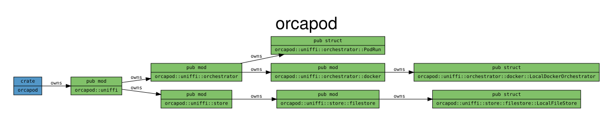

[
](https://walkerlab.github.io/orcapod/)
[](https://codecov.io/github/walkerlab/orcapod)

# orcapod



## Tests

```bash
#!/bin/bash
set -e  # fail early on non-zero exit
cargo clippy --all-targets -- -D warnings  # Rust syntax and style tests
cargo fmt --check  # Rust formatting test
cargo llvm-cov --ignore-filename-regex "bin/.*|lib\.rs" -- --nocapture  # Rust integration tests w/ stdout coverage summary
cargo llvm-cov --ignore-filename-regex "bin/.*|lib\.rs" --html -- --nocapture  # Rust integration tests w/ HTML coverage report (target/llvm-cov/html/index.html)
cargo llvm-cov --ignore-filename-regex "bin/.*|lib\.rs" --codecov --output-path target/llvm-cov-target/codecov.json -- --nocapture  # Rust integration tests w/ codecov coverage report
cargo llvm-cov --ignore-filename-regex "bin/.*|lib\.rs" --cobertura --output-path target/llvm-cov-target/cobertura.xml -- --nocapture  # Rust integration tests w/ cobertura coverage report
. ~/.local/share/base/bin/activate && maturin develop --uv && RUST_BACKTRACE=1 python tests/extra/python/smoke_test.py -- tests/.tmp # Python integration tests
```

## Docs

```bash
cargo doc --no-deps                       # gen api docs (target/doc/orcapod/index.html)
cargo modules dependencies --lib --no-uses --no-fns --focus-on "orcapod::uniffi::{model::{Pod,PodJob,PodResult},store::filestore::LocalFileStore,orchestrator::{PodRun,docker::LocalDockerOrchestrator}}" --layout dot > docs/images/orcapod_diagram.dot # orcapod diagram as DOT
cargo modules dependencies --lib --no-uses --no-fns --focus-on "orcapod::uniffi::{model::{Pod,PodJob,PodResult},store::filestore::LocalFileStore,orchestrator::{PodRun,docker::LocalDockerOrchestrator}}" --layout dot | dot -T png > docs/images/orcapod_diagram.png # orcapod diagram as PNG
cargo modules dependencies --lib --no-uses --no-fns --focus-on "orcapod::uniffi::{model::{Pod,PodJob,PodResult},store::filestore::LocalFileStore,orchestrator::{PodRun,docker::LocalDockerOrchestrator}}" --layout dot | dot -T svg > docs/images/orcapod_diagram.svg # orcapod diagram as SVG
```

## Project Management

Progress is tracked under GH project [orcapod](https://github.com/orgs/walkerlab/projects/2).
We track only issues in the project so don't add PRs.

### Flow

1. Contributor indicates to others they are picking up an issue by:
   - Self-assigning the issue
   - Opening a draft PR to `dev` branch that links the issue(s) it will fix
   - Updating the issue status to `In Progress`
2. Contributor indicates to others their contribution is ready for review by:
   - Marking their draft PR as `Ready for Review`
   - Assigning reviewers
   - Updating the issue status to `Ready for Review`
3. Reviewers should do the following after submitting a review:
   - If any updates were requested:
     - Update the issue status to `Changes Requested`
   - If changes are approved:
     - Merge the PR
     - Either update the issue status to `Done` or close the issue manually
4. Contributors working on reviewer requested changes should:
   - Convert their PR to draft
   - Update the issue status to `In Progress`
   - Repeat steps 2 and 3 as needed

### Views

- `Overview`: A birdseye view of issues in table form. Convenient for sorting and updating priority, estimate, assignee, and status.
- `Kanban`: A board to capture live progress visually. Status can be updated by dragging cards to their appropriate status column.

### Automation Note

- Newly opened issues are automatically added with the status `Todo`
- Reopened issues will automatically update status to `Todo`
- Issue will automatically close once their status is updated to `Done`
- Manually closed issues will automatically update status to `Done`

## Set permissions to system defaults

```bash
# based on debian
chmod u=rwx,g=rx,o=rx $(find . -not -path "./.git*" -type d | sort)  # directories
chmod u=rw,g=r,o=r $(find . -not -path "./.git/*" -type f | sort)  # files
```

## Limit DevContainer Resource Access

You can easily enforce resource limits by adding the following to `devcontainer.json`.

```json
{
  // ..
  "runArgs": [
    // ..
    "--cpus=2",,
    "--memory=8gb",
    // ..
  ],
  // ..
}
```
